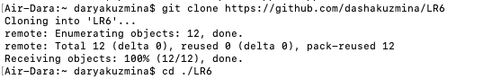
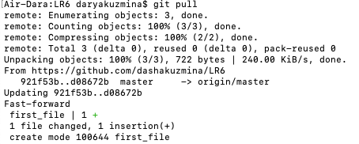
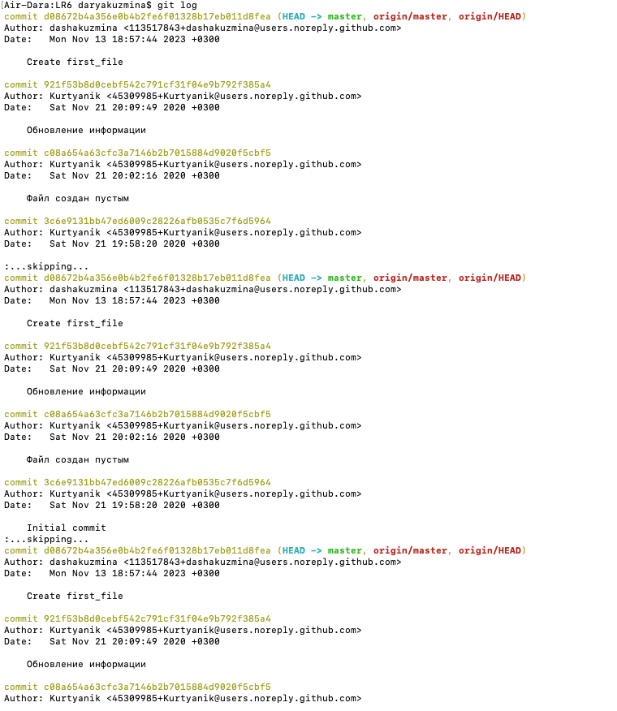
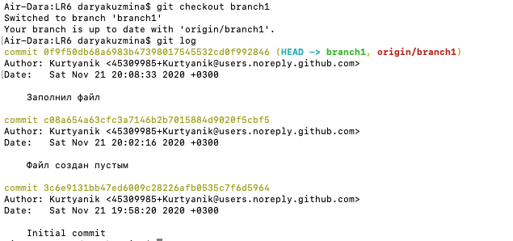
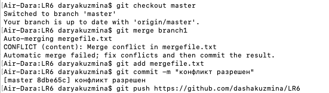
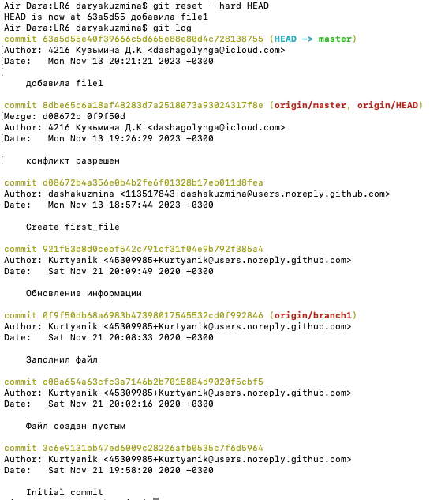
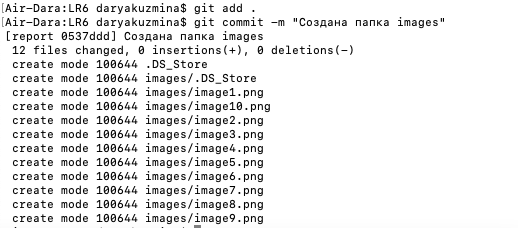
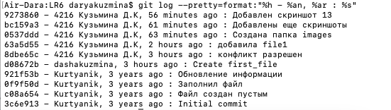

# Лабораторная работа №6. Система контроля версий
## Цель лабораторной работы:
изучение базовых возможностей системы управления версиями, опыт работы с Git Api, опыт работы с локальным и удаленным репозиторием.
## Ход работы:
### 1. Клонирование репозитория, изменение имени пользователя и email.




### 2. Добавление файла через интерфейс GitHub и загрузка изменений.



### 3. Получение истории операций для каждой из веток.





### 4. Слияние в ветку master.



### 5. Удаление ветки.
 


### 6. Добавление файла и коммита.


### 7. Откат коммита.



### 8. Создание ветки для отчета.


### 9. Добавление скриншотов.



### 10. Загрузка директории в ветку для отчета.


### 11. Полученная история операций.



## Лог команд:
```
git config user.name "4216 Кузьмина Д.К"
git config user.email "dashagolynga@icloud.com"
git clone
git pull
git checkout master
git log
git checkout branch1
git log
git checkout master
git merge branch1
git add mergefile.txt
git commit -m "конфликт разрешен"
git push origin
git branch -d branch1
git add .
touch file1.txt
git add file1.txt
git commit -m "добавила file1"
git reset --hard HEAD
git log
git branch report
git checkout report
git push origin
git add .
git commit -m "Создана папка images"
git add .
git commit -m "Добавлены еще скриншоты"
git push origin report
git add .
git commit -m "Добавлен скриншот 13"
git push origin report
git log --pretty=format:"%h - %an, %ar : %s"
```
## Вывод:
В ходе лабораторной работы мы изучили базовые возможности системы управления версиями, получили опыт работы с Git Api и опыт работы с локальным и удаленным репозиториями.
