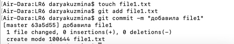
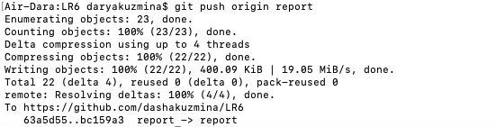

# Лабораторная работа №6. Система контроля версий
## Цель лабораторной работы:
изучение базовых возможностей системы управления версиями, опыт работы с Git Api, опыт работы с локальным и удаленным репозиторием.
## Ход работы:
1. Клонирование репозитория, изменение имени пользователя и email.
   
   
2. Добавление файла через интерфейс GitHub и загрузка изменений.
   
3. Получение истории операций для каждой из веток.
   
   
4. Слияние в ветку master.
   
5. Удаление ветки.
   
6. Добавление файла и коммита.
   
7. Откат коммита.
   
8. Создание ветки для отчета.
   
9. Добавление скриншотов.
   
10. Загрузка директории в ветку для отчета.
    
11. Полученная история операций.
## Лог команд:
## Вывод:
В ходе лабораторной работы мы изучили базовые возможности системы управления версиями, получили опыт работы с Git Api и опыт работы с локальным и удаленным репозиториями.

